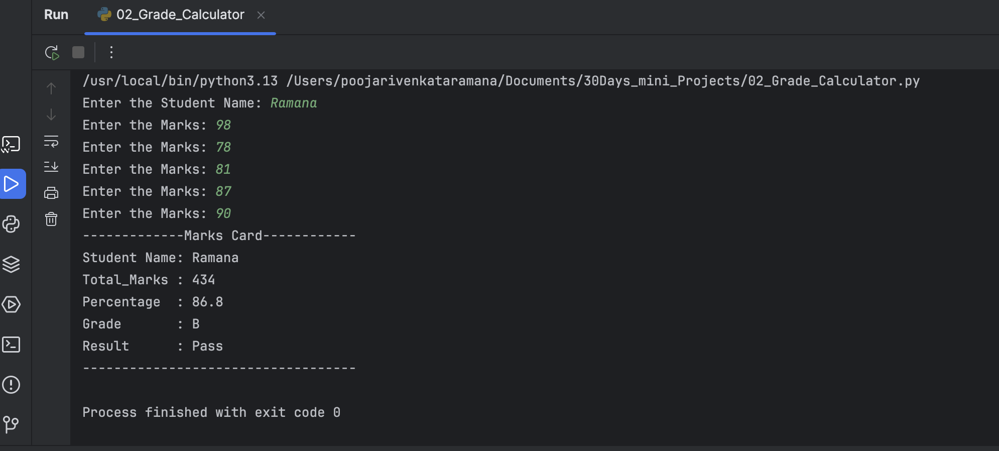

# 📚 Day 02 - Grade Calculator

## 📌 Project Description

A simple Python Grade Calculator that accepts a student's name and marks for five subjects, validates the inputs, calculates the total marks, percentage, assigns a grade, and displays the final result.

---

## 🚀 Features

- ✅ Student name validation
- ✅ Marks validation (0–100)
- ✅ Calculates total marks
- ✅ Calculates percentage
- ✅ Assigns Grade (A/B/C/D/F)
- ✅ Displays Pass/Fail status
- ✅ Clean formatted output

---

## 📷 Project Output

  

---

## 🛠️ Technologies Used

- Python 3
- Variables
- Input & Output
- Conditional Statements
- Arithmetic Operators

---

## 📥 Input

- Student Name
- Marks for 5 Subjects

---

## 📤 Output

- Student Name
- Total Marks
- Percentage
- Grade
- Result (Pass/Fail)

---

## 🧮 Grade Criteria

| Percentage | Grade |
|------------|-------|
| 90–100 | A |
| 80–89 | B |
| 70–79 | C |
| 60–69 | D |
| Below 60 | F |

---

## 📖 Concepts Practiced

- Variables
- User Input
- Input Validation
- Conditional Statements
- Arithmetic Operations
- Formatted Output

---

## 🎯 Learning Outcome

This project helped me strengthen my understanding of Python input validation, conditional statements, arithmetic calculations, and formatted console output.

---

### 🚀 30 Days – 30 Python Mini Projects

**Day 02 Completed ✅**
